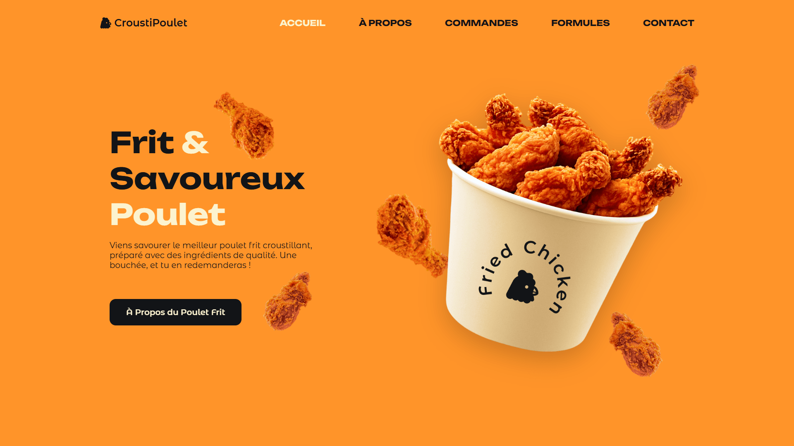

<div align="center">  
    <a href="https://fried-chicken-shop-vm.netlify.app/" target="_blank">  
        
    </a>
    </br>  
    </br>  
  <h3 align="center">🍗 CroustiPoulet &nbsp; — &nbsp; Restaurant de Poulet Frit</h3>  
</div>

## <br /> 📌 Sommaire

&nbsp;&nbsp;&nbsp; 🎨 &nbsp; [**Introduction**](#introduction)<br />
&nbsp;&nbsp;&nbsp; 🛠️ &nbsp; [**Technologies**](#technologies)<br />
&nbsp;&nbsp;&nbsp; 🎯 &nbsp; [**Fonctionnalités**](#fonctionnalités)<br />
&nbsp;&nbsp;&nbsp; 🚀 &nbsp; [**Installation**](#installation)<br />

## <br /> <a name="introduction">🎨 Introduction</a>

CroustiPoulet est une landing page savoureuse pour un restaurant de poulet frit. Ce site présente des sections immersives avec animation ScrollReveal, commandes interactives, visuels appétissants et un système de navigation fluide et responsive.

## <br /> <a name="technologies">🛠️ Technologies</a>

- HTML5 sémantique et structuration claire
- CSS3 moderne avec variables, media queries et animations
- JavaScript ES6 clair et modulaire
- [ScrollReveal](https://scrollrevealjs.org/) pour des animations au scroll
- [Remix Icons](https://remixicon.com/) pour des icônes vectorielles modernes
- Responsive Design pensé en mobile-first

## <br /> <a name="fonctionnalités">🎯 Fonctionnalités</a>

- Présentation des produits
- Design immersif avec images et overlays
- Menu mobile responsive avec animation
- Affichage des prix pour chaque produit
- Section contact complète
- Boutons de commande interactifs
- Formulaire d’inscription par email
- Affichage des moyens de paiement acceptés
- Réseaux sociaux accessibles dans le footer
- Navigation fluide avec lien actif au scroll

## <br /> <a name="installation">🚀 Installation</a>

### ✅ Prérequis

- [Google Chrome](https://www.google.com/) &nbsp;—&nbsp; Navigateur moderne
- [Visual Studio Code](https://code.visualstudio.com/) &nbsp;—&nbsp; Éditeur de code
- [Live Server](https://marketplace.visualstudio.com/items?itemName=ritwickdey.LiveServer) &nbsp;—&nbsp; Extension VS Code

### 📥 Cloner le projet

```bash
git clone git@github.com:ValentinMadiot/fried-chicken-shop_ui
cd fried-chicken-shop_ui
```

### ▶️ Lancer le projet

Il suffit d’ouvrir le fichier `index.html` dans un navigateur, ou d’utiliser l’extension **Live Server** sur VS Code pour un aperçu dynamique.
